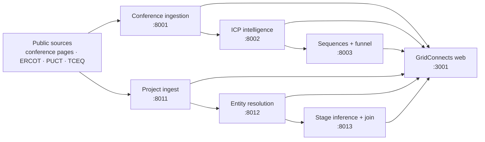

# GridConnects

**Connect the project. Find the person. Move first.**

GridConnects turns fragmented public energy-market signals into an actionable network of projects, companies, decision-makers, and outreach moments. It combines an ERCOT-focused power project atlas with an agent-powered conference intelligence desk in one product.

Built for the Candid Intelligence AI × Energy Hackathon in Houston.

## What it does

GridConnects has two connected workflows:

- **Map — ERCOT Power Project Atlas:** explore Texas power projects, queue capacity, status, technology, and source evidence on an interactive map.
- **Signal — Conference Intelligence Desk:** discover energy conferences, extract speakers and sessions, rank people against Candid's ICP, draft event-timed outreach, and track the funnel.

The current product UI lives in [`frontend/`](frontend/). Open `/app` and use the floating **Signal / Map** control to switch between workflows.

## Architecture



All six agents are small Node.js/TypeScript services. MongoDB Atlas persistence and OpenAI enrichment are optional: deterministic fallbacks and committed demo fixtures keep the core demo usable without credentials.

## Quick start

### Full stack with Docker

Requirements:

- Docker with Compose
- Optional: a MongoDB Atlas connection string for persistence
- Optional: an OpenAI API key for model-assisted extraction, scoring, and drafting

```bash
cp .env.example .env
docker compose up --build
```

If you do not want persistence, leave `MONGODB_URI` empty in `.env`. If `OPENAI_API_KEY` is empty, the services use deterministic fallbacks.

Open:

| Surface | URL |
| --- | --- |
| GridConnects landing page | [http://localhost:3001](http://localhost:3001) |
| Unified Map + Signal product | [http://localhost:3001/app](http://localhost:3001/app) |
| Standalone Signal dashboard | [http://localhost:3000](http://localhost:3000) |

Useful commands:

```bash
make run       # build and start the stack
make rerun     # stop, rebuild, and start
make logs      # follow service logs
make ps        # show container status
make kill      # stop the stack
```

### Frontend only

Use this when working on the landing page, Atlas, or Signal UI. Node.js 20 or newer is required.

```bash
cd frontend
cp .env.example .env.local
npm ci
npm run dev
```

The frontend starts at [http://localhost:3000](http://localhost:3000) when run outside Compose. Its local environment defaults expect the agents on ports `8001–8003` and `8011–8013`; fixture-backed UI still renders when they are unavailable.

## Services

| Service | Port | Responsibility |
| --- | ---: | --- |
| [`frontend/`](frontend/) | 3001 via Compose | Landing page and unified Map + Signal product |
| [`speaker-signal/`](speaker-signal/) | 3000 | Standalone Signal dashboard retained for the original demo |
| [`speaker-signal-ingestion/`](speaker-signal-ingestion/) | 8001 | Conference discovery, bounded crawl, extraction, and evidence |
| [`intelligence-service/`](intelligence-service/) | 8002 | Normalization, deduplication, ICP scoring, ranking, and reasons |
| [`gtm-service/`](gtm-service/) | 8003 | Event-anchored sequences, draft generation, and funnel state |
| [`project-radar-ingest/`](project-radar-ingest/) | 8011 | Multi-source project record ingestion |
| [`project-radar-normalize/`](project-radar-normalize/) | 8012 | Project normalization and cross-source entity resolution |
| [`project-radar-score/`](project-radar-score/) | 8013 | Stage inference, confidence scoring, ranking, and people joins |

Each agent exposes `GET /health`; the agent services also expose Swagger documentation at `/docs`.

## Data flows

### Signal

1. Agent 1 discovers or ingests a public conference page.
2. It extracts conferences, sessions, speakers, topics, and source evidence.
3. Agent 2 cleans and deduplicates records, then produces an explainable `0–100` ICP score.
4. Agent 3 creates a cadence anchored to the conference date and maintains funnel state.
5. The Signal desk presents Calendar, Contacts, Sequences, Funnel, Agent, and Profile views.

### Map

1. Radar R1 ingests fixture-backed ERCOT, PUCT, and TCEQ-style records.
2. Radar R2 resolves aliases and LLC names into canonical projects.
3. Radar R3 infers project stage with confidence and evidence, then joins relevant people.
4. The ERCOT Atlas visualizes project location, capacity, technology, status, and queue context.

## Configuration

Copy [`.env.example`](.env.example) to `.env` for Compose. The most important variables are:

| Variable | Required | Purpose |
| --- | --- | --- |
| `MONGODB_URI` | No | Persists ingestion, qualification, project, sequence, and funnel data |
| `OPENAI_API_KEY` | No | Enables model-assisted extraction, scoring, explanations, and drafting |
| `OPENAI_MODEL` | No | Model used by agent services; defaults to `gpt-4o-mini` |
| `FIRECRAWL_API_KEY` | No | Enables the optional dashboard crawl preview |
| `SEND_MODE` | No | `mock` by default; prevents outbound delivery |
| `SMTP_*` | No | Used only for an explicitly configured local demo send |

Do not commit `.env` or other secrets.

## Demo safety and graceful degradation

- **Public data only:** conference pages and public project/permit-style records.
- **Evidence first:** extracted and inferred records retain source context.
- **Bounded crawling:** discovery is rate-limited, depth-limited, and deduplicated.
- **Draft-only outreach:** `SEND_MODE=mock` is the default. Sequences do not automatically email leads.
- **No OpenAI key:** services fall back to deterministic parsing, scoring, and templates.
- **No MongoDB URI:** services return results over HTTP without persisting them.
- **Unreliable venue Wi-Fi:** committed fixtures preserve the demo path.

## Development

Build, lint, or test an individual package from its directory:

```bash
npm ci
npm run typecheck   # agent packages that expose it
npm test            # packages with Vitest suites
npm run build
```

For the unified frontend:

```bash
cd frontend
npm run lint
npm run build
```

For the standalone `speaker-signal` package, use pnpm:

```bash
cd speaker-signal
pnpm install
pnpm test
pnpm run build
```

## Repository guide

```text
frontend/                    Current GridConnects landing page and product UI
  app/app/                   Unified Map + Signal route
  components/SignalDesk.tsx  Signal workspace
  public/ercot-atlas.html    Self-contained ERCOT Atlas
speaker-signal/              Original standalone Signal dashboard
speaker-signal-ingestion/    Conference ingestion agent
intelligence-service/        ICP intelligence agent
gtm-service/                 Outreach and funnel agent
project-radar-ingest/        Project ingestion agent
project-radar-normalize/     Project entity-resolution agent
project-radar-score/         Project scoring and people-join agent
docs/                        Product specs, demo script, and deployment notes
```

## Documentation

- [Hackathon submission and demo narrative](SUBMISSION.md)
- [Speaker Signal product specification](docs/SPEAKER_SIGNAL_SPEC.md)
- [Project Radar product specification](docs/PROJECT_RADAR_SPEC.md)
- [Demo script](docs/DEMO_SCRIPT.md)
- [Render deployment guide](docs/RENDER.md)

## Deployment

The repository includes [`render.yaml`](render.yaml) for a Render Blueprint. See [the Render guide](docs/RENDER.md) for service wiring, required secrets, health checks, and Atlas network access.

## Status

Hackathon prototype. The repository is fixture-first and demo-safe; live data adapters, production authentication, observability, and fully automated engagement tracking remain future work.

