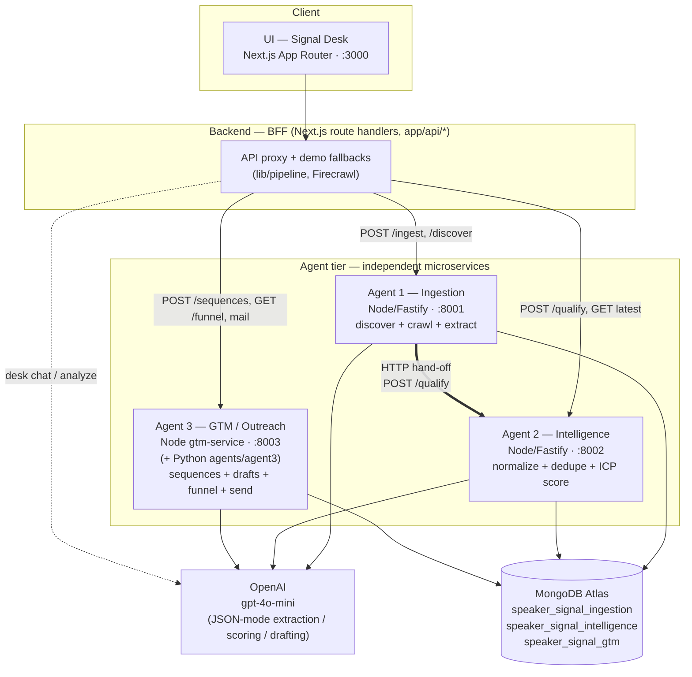
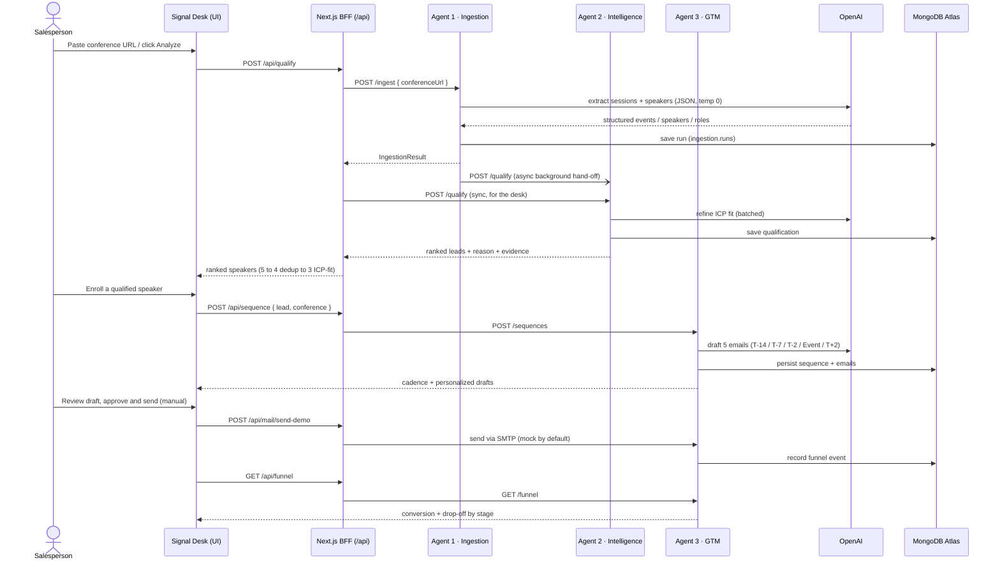
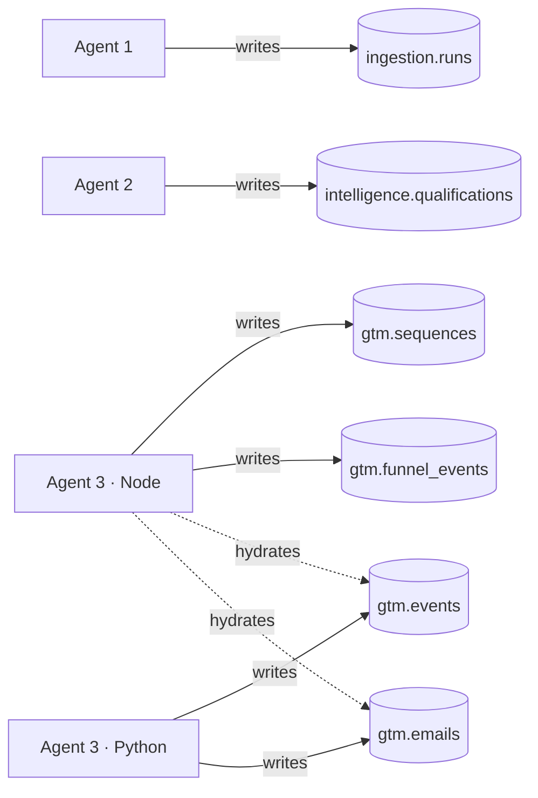
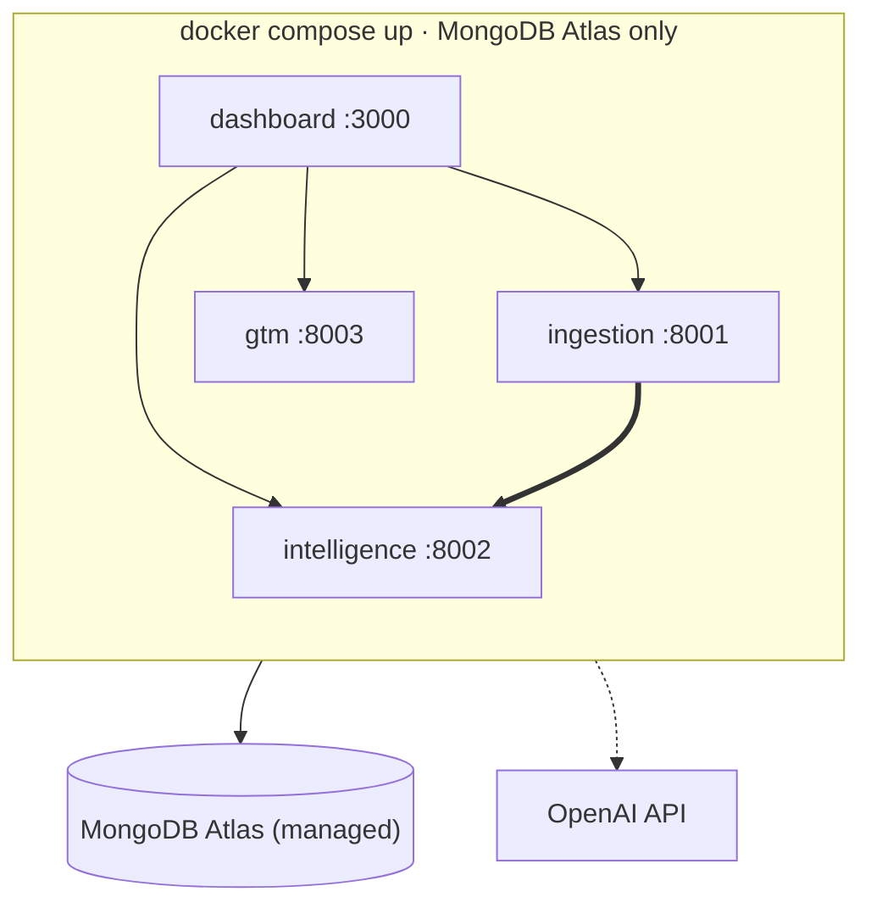

# Speaker Signal — System Architecture

*Solution-architecture reference · Candid Intelligence AI Hackathon · Track 2*

---

## 1. Purpose & context

**Speaker Signal** automates the slowest part of enterprise origination: finding the right buyer
*before* a project reaches RFP. Today a salesperson manually watches conference sites, reads agendas,
copies speaker names into a spreadsheet, researches each person, and hand-writes emails. The data is
public — the bottleneck is that a human has to assemble it.

The system turns a **public conference agenda** into a **timed, personalized, human-approved outreach
motion**, end to end:

> **Events → Speakers → ICP score → Generated emails → Human-approved send → Funnel**

The target buyer (Candid's ICP) is engineering-execution leadership at lean energy /
data-center-power owner-operators and developers — people who get on stage and describe exactly the
project they're working on.

This document describes **what runs, how the pieces fit, and why the boundaries are drawn where they
are.** It is the technical companion to the product spec (`docs/SPEAKER_SIGNAL_SPEC.md`) and the demo
narrative (`Demo_Script.pdf`).

---

## 2. Architectural style

A **pipeline of decoupled agents** behind a thin backend-for-frontend (BFF), on a shared managed
database. Each stage of the origination pipeline is an independent microservice that:

- owns **one responsibility** and **one MongoDB database**;
- exposes a **small HTTP contract** (documented via Swagger at `/docs`);
- **degrades gracefully** — runs with or without OpenAI, with or without MongoDB;
- hands off to the next stage over HTTP, **never blocking** on a downstream failure.

This is what lets a 4-person team build in parallel and demo reliably: any agent can be stubbed,
mocked, or run offline, and the UI still completes the flow via embedded fallbacks.

### 2.1 Component diagram (requested view)



**Reading the diagram.** The browser talks only to the **BFF** (the dashboard's server-side
`app/api/*` handlers). The BFF fans out to the three agents; if any is unreachable it falls back to an
embedded TypeScript pipeline so the demo never dead-ends. **Agent 1 also hands off directly to Agent 2**
so ingestion can run autonomously in the background, independent of the UI. All three agents call
**OpenAI** for their LLM step (each with a deterministic fallback) and persist to their own database
in the shared **MongoDB Atlas** cluster. The dashboard holds **no database connection of its own** —
all state lives behind the agents.

---

## 3. End-to-end flow



The signature demo numbers — **5 ingested → 4 after dedupe → 3 ICP-qualified** — come from a fixture
GridForward agenda containing one duplicate speaker and one non-ICP journalist, so the funnel math is
always visible on stage.

---

## 4. Services

All three backend agents share one shape: **Node ≥18.18 · TypeScript (ESM) · Fastify 5**, with
`@fastify/swagger` (+ Swagger UI at `/docs`), the official `mongodb` and `openai` SDKs, `zod`
validation, and `dotenv` reading a shared repo-root `.env`. Port resolution is uniform:
*service-specific env → `PORT` (Render) → local default.* Every service runs standalone; Mongo and
OpenAI are both optional.

| # | Service (dir) | Role | Runtime | Port | Owns DB |
|---|---|---|---|---|---|
| 1 | `speaker-signal-ingestion` | Discovery + crawl + extract | Node/Fastify + Cheerio/Playwright | 8001 | `speaker_signal_ingestion` |
| 2 | `intelligence-service` | Normalize, dedupe, ICP-score, rank, explain | Node/Fastify | 8002 | `speaker_signal_intelligence` |
| 3 | `gtm-service` | Sequences, drafts, funnel, SMTP send | Node/Fastify + nodemailer | 8003 | `speaker_signal_gtm` |
| 3b| `agents/agent3` | Parallel Python Agent 3 (same GTM contract) | Python/Flask + pymongo | 8003 | `speaker_signal_gtm` |
| — | `speaker-signal` | Signal Desk UI + BFF proxies | Next.js 16 / React 19 | 3000 | *(none — no direct DB)* |

### 4.1 Agent 1 — Ingestion (`speaker-signal-ingestion`, :8001)

**Responsibility.** Turn a public conference URL into structured data. Does a **bounded** public crawl
(discovers useful pages, fetches HTML), then LLM-extracts conference metadata, sessions, and speakers
with roles and topics. Also performs cold-start **discovery** of related conferences from seed venues
and auto-ingests newly discovered relevant events.

**API.**
| Method · Path | Purpose |
|---|---|
| `POST /ingest` | Crawl one conference URL → `IngestionResult`; fire-and-forget hand-off to Agent 2 |
| `POST /discover` | Cold-start discovery from `seedUrls[]`, classify relevance, auto-enqueue |
| `GET /auto-ingest` | Inspect the background auto-ingest queue |
| `GET /health` · `GET /docs` | Liveness + Swagger |

**MongoDB.** DB `speaker_signal_ingestion`, collection **`runs`** (unique index on `runId`). Writes each
completed run; reads the previous run by `conference.websiteUrl` for freshness / change detection.

**OpenAI.** `gpt-4o-mini`, JSON mode, temperature 0, for page → structured extraction (speakers,
sessions, roles, topics, confidence). **Fallback:** with no API key, a deterministic Cheerio/regex
`genericConferenceParser`. LinkedIn URLs are harvested from the DOM, never invented.

**Coupling.** Hands off to `INTELLIGENCE_URL` (`POST /qualify`) after each run, gated by
`HANDOFF_ENABLED`, and **never throws on hand-off failure**. Bounded seed list via `BOOTSTRAP_SEEDS`
(7x24 Exchange, Data Center World, Infrastructure Masons).

### 4.2 Agent 2 — Intelligence (`intelligence-service`, :8002)

**Responsibility.** Turn noisy scraped data into explainable sales intelligence. Normalizes
names/companies/titles, **dedupes** speakers and companies, **scores ICP fit**, ranks by a weighted
blend, and produces a human-readable **"why this person matters"** plus evidence chips.

**API.**
| Method · Path | Purpose |
|---|---|
| `POST /qualify` | Ingestion payload → ranked qualified leads (`minScore`, `useOpenAi` options) |
| `GET /qualifications/latest` | Most recent persisted qualification (desk hydration) |
| `GET /health` · `GET /docs` | Liveness + Swagger |

**MongoDB.** DB `speaker_signal_intelligence`, collection **`qualifications`** (unique index
`qualificationId`). Upserts each run; reads latest by timestamp.

**OpenAI.** `gpt-4o-mini`, JSON mode, temp 0 — refines only the `companyIcpFit` signal, batched up to
40 leads. **Fallback:** full deterministic scoring (`deterministicScore.ts`); each run reports
`icpEnrichment: "openai" | "deterministic"`. Config (weights, tier cutoffs, default `minScore` 45,
eligible roles) is centralized in `score/icpConfig.ts`.

**The ICP model.** Five criteria; the **two highest-precision** ones are implemented today because
they're directly on the agenda page:

| # | Criterion | Signal | Status |
|---|---|---|---|
| 1 | Seniority / role | VP Eng, Director of Projects, Head of Delivery — owns engineering execution | **Built** |
| 2 | Session topic | Behind-the-meter, gas-to-power, data-center power, AI load (ESG panel scores low) | **Built** |
| 3 | Company type | Lean owner-operators & developers; large EPCs are a poor fit | Next |
| 4 | Project stage | Concept / pre-FEED / FEED language (already under construction = too late) | Next |
| 5 | Geography | Texas, Gulf Coast, ERCOT market | Next |

Criteria 3–5 need enrichment beyond the agenda, which is the stated path to a RAG layer over a vector
DB (score from real company/project context rather than keywords).

### 4.3 Agent 3 — GTM / Outreach (`gtm-service` :8003; Python `agents/agent3`)

**Responsibility.** Turn a qualified speaker into an **event-anchored outreach campaign** and make the
motion legible. Builds a 5-touch cadence from the conference date, generates a **personalized draft per
touch** grounded in the speaker's talk, tracks the lead through a funnel, and (optionally) sends via
SMTP. **Drafts only — never auto-sends.**

**Cadence (anchored to `conference.startDate`):**

| Anchor | Offset | Intent |
|---|---|---|
| T-14 | −14d | first touch |
| T-7  | −7d  | follow-up |
| T-2  | −2d  | "let's meet at the event" nudge |
| Event | 0d  | meet in person |
| T+2  | +2/+3d | follow-up to book a real conversation |

**Funnel stages:** `identified → contacted → replied → meeting → met → follow-up → booked`.

**API (dashboard contract).**
| Method · Path | Purpose |
|---|---|
| `POST /sequences` | Generate + persist a sequence for `{ lead, conference }` |
| `GET /sequences` · `GET /sequences/:id` · `GET /sequences/by-lead/:leadId` | Read (Juicebox-style) |
| `PATCH /sequences/:id/steps/:stepId` | Update a step (status / subject) |
| `POST /funnel/events` · `GET /funnel` | Record a stage change · rolled-up funnel |
| `GET /mail/status` · `POST /mail/test` · `POST /mail/send-demo` | SMTP status + demo send |

**MongoDB.** DB `speaker_signal_gtm`. Owns **`sequences`** and **`funnel_events`**. The Node service can
also *hydrate* documents written by the Python Agent 3 (`emails`, `events`) into the dashboard shape.

**OpenAI.** `gpt-4o-mini` drafts the 5 emails grounded on session/topic/evidence with a mandatory
opt-out line. **Fallback:** evidence-grounded per-anchor templates; each draft is tagged
`generatedBy: "openai" | "template"`.

**Two implementations — why.** The **Node `gtm-service`** is the canonical Agent 3 wired into
`docker-compose` and the dashboard. The **Python `agents/agent3`** is a parallel implementation of the
same GTM contract (via `compat.py`, mapping internal kinds/stages to the dashboard's
`T-14…T+2` / `identified…booked`). It additionally provides a **real SMTP path** (Zoho/Gmail) and a
**background automation loop** (`worker.py`): scan unseen events → generate scheduled emails → send due
emails, with an **atomic claim guaranteeing no email is ever sent twice.** Both write to the same
`speaker_signal_gtm` DB; the Node service reads the Python stack's `emails`/`events` if present. They
are not run on the same port simultaneously.

### 4.4 Signal Desk — UI + BFF (`speaker-signal`, :3000)

**Responsibility.** The explorable "Signal Desk" and the **backend-for-frontend**. Next.js 16 App Router
(React 19). Pages under `app/(desk)/`: `/` (home), `/speakers`, `/companies`, `/conferences`,
`/sequences`, `/funnel`, `/projects` (Track 1), `/agent-runs` (system health), `/ask` (desk assistant).

**The BFF (`app/api/*`)** is the only thing the browser talks to. It proxies to the agents and carries
**embedded fallbacks** so the demo survives a cold backend:

| BFF route | Target |
|---|---|
| `POST /api/qualify` | Agent 1 `/ingest` → Agent 2 `/qualify` (fallback: `lib/pipeline/qualify`) |
| `GET /api/leads/latest` | Agent 2 `/qualifications/latest` |
| `POST /api/discover` | Agent 1 `/discover` |
| `POST /api/sequence` · `GET /api/sequences` | Agent 3 `/sequences` (fallback: `lib/pipeline/sequence`) |
| `GET/POST /api/funnel` | Agent 3 `/funnel` · `/funnel/events` |
| `GET /api/mail/status` · `POST /api/mail/send-demo` | Agent 3 mail routes |
| `GET /api/health` | Fan-out to Agents 1+2+3 `/health` in parallel |
| `POST /api/analyze` | **Firecrawl** direct scrape (no agent) — demo Analyze |
| `POST /api/chat` | OpenAI desk assistant (`lib/pipeline/desk-chat`) |

Backend base URLs resolve from `INGESTION_API_URL` / `INTELLIGENCE_API_URL` / `GTM_API_URL`
(`lib/agents.ts`). The dashboard uses **no MongoDB directly**.

---

## 5. Data & persistence

**One Atlas cluster, one `MONGODB_URI`, database-per-service isolation.** There is no shared schema and
no cross-service foreign keys — services exchange data over HTTP, not by reading each other's tables.
This keeps ownership crisp and lets any service be reset independently.



**Core documents (conceptual).**
- **run** (ingestion) — a crawl result: conference metadata + sessions + speakers (name, company, role, topic, confidence, LinkedIn if present).
- **qualification** (intelligence) — ranked leads with `icpScore`, `reason`, `evidence[]`, dedupe applied, `icpEnrichment` provenance.
- **sequence / emails** (gtm) — a lead's cadence: per-step `anchor` (T-14…T+2), `scheduledDate`/`send_at`, `subject`, `body` (personalized, opt-out), `status`, `generatedBy`, and an idempotent `sent` guard.
- **funnel_events** (gtm) — append-only stage transitions used to roll up conversion and drop-off.

All persistence is **optional**: with no `MONGODB_URI`, services return results over HTTP and fall back
to in-memory maps (nothing is persisted, but the flow still works).

---

## 6. Cross-cutting concerns

**Resilience / graceful degradation — the core design principle.** Every external dependency has a
fallback: no OpenAI key → deterministic parsing/scoring/templating; no MongoDB → in-memory, non-persisted;
an agent unreachable → the BFF serves an embedded TypeScript pipeline; live scraping risky on stage →
fixture ingestion. A judge can complete the definition-of-done **with no API keys and no network.**

**Human-in-the-loop.** The pipeline drafts; a person approves and sends. `SEND_MODE=mock` is the default
(logs only, nothing leaves the machine). This is a product stance, not just a safety rail — "a human
approves what goes out under your name."

**Compliance & data ethics.** Public data only (agendas, speaker directories). Bounded, robots-respecting
crawl with an honest User-Agent and rate limits. Every draft references the person's **own talk** (real
relevance, not a spam cannon) and carries an **opt-out** line. No fabricated facts — missing fields are
omitted from copy rather than invented.

**Idempotency & safety on send.** The Python Agent 3 claims each email atomically (`sent != true`) before
delivering and releases it on failure, so retries and concurrent workers can never double-send.

**Configuration.** Single repo-root `.env` shared by all services via Compose `env_file`. Notable keys:
`MONGODB_URI`, `OPENAI_API_KEY`/`OPENAI_MODEL`, per-service `*_PORT` and `MONGODB_DB`,
`HANDOFF_ENABLED` + `INTELLIGENCE_URL` (A1→A2), `BOOTSTRAP_SEEDS`, and the Agent-3 send block
(`SEND_MODE`, `SMTP_*`, `SENDER_*`, `TEST_TO_EMAIL`).

**Observability.** Each agent exposes `/health` (with Mongo status) and Swagger `/docs`; the dashboard's
`/agent-runs` page and `/api/health` aggregate live status across the three agents.

---

## 7. Deployment



A single `docker-compose.yml` builds and wires all services; each gets its `MONGODB_DB` and the shared
`.env`. In-container hostnames (`http://ingestion:8001`, etc.) are injected so services find each other.
Health checks gate readiness. `render.yaml` mirrors this for cloud deploy. The **same repo also ships
Track 1 — Project Radar** (`radar-ingest`/`normalize`/`score` on 8011–8013 + an atlas UI on 3001), a POC
that reuses the identical Node/Fastify + Mongo + handoff pattern for *projects* rather than *people*.

> **Legacy note.** The top-level `backend/` (Flask OKR) and `frontend/` are boilerplate the repo was
> forked from; `frontend/` is now reused as the Track 1 atlas UI, and `backend/` is not part of the
> Speaker Signal runtime.

---

## 8. Design rationale & roadmap

**Why decoupled agents over a monolith.** Parallel team ownership, independent failure/fallback, and a
schema that "extends cleanly" — the agents are the seams along which the product grows.

**Why an LLM instead of title keyword rules.** The signal is in the **talk topic**, not the job title:
two VPs of Engineering are not equivalent if one speaks on behind-the-meter power for AI data centers
and the other sits on a reporting panel. The score always ships with its **reason**, so it's auditable
by eye rather than a black box.

**Roadmap (one direction per layer).**
- **Agent 1 — coverage:** broader platform support and a genuinely self-updating calendar (new events appear without a human).
- **Agent 2 — depth:** a RAG layer over a vector DB (Chroma/Pinecone) to unlock criteria 3–5 (company type, project stage, geography) from real context.
- **Agent 3 — motion:** fully automated cadence + real open/reply/meeting instrumentation wired into the funnel, and handling replies, not just first touch.
- **The long game:** join speakers to **live project data** — rank people by whether they have a *hot project right now*, not by title.
```
